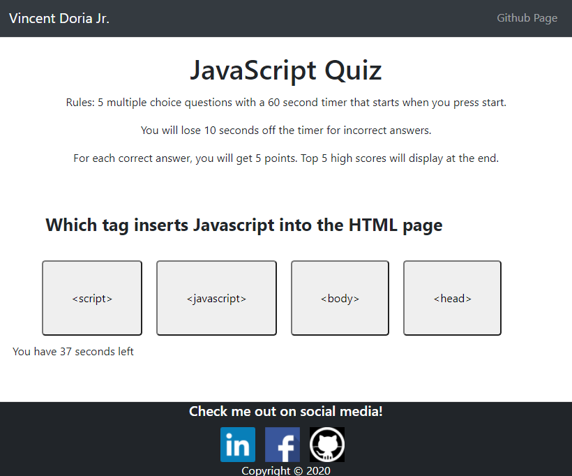
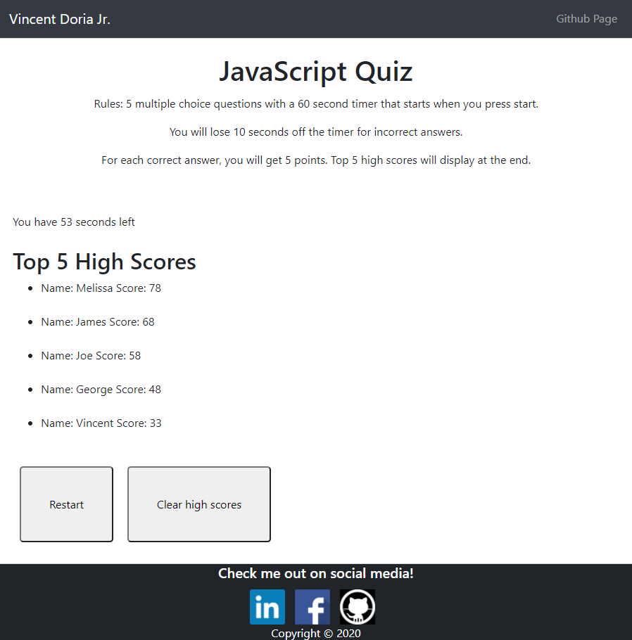

https://cenzo-cmd.github.io/JavaScript_Quiz/

JavaScript is one of the most versatile coding languages. Paired with HTML 5.0 & CSS the possibilities are endless.

The link above contains a JavaScript quiz. All questions are multiple choice and there is a 60 second timer.

Correct answers earn 5 points, incorrect answers will deduct 10 seconds off the clock.

Total high score is correct answer points + timer left on clock.

Top 5 high scores will be displayed.

 
There is a restart button and clear high score button on the final screen.

Good luck!
༼ つ ◕_◕ ༽つ
